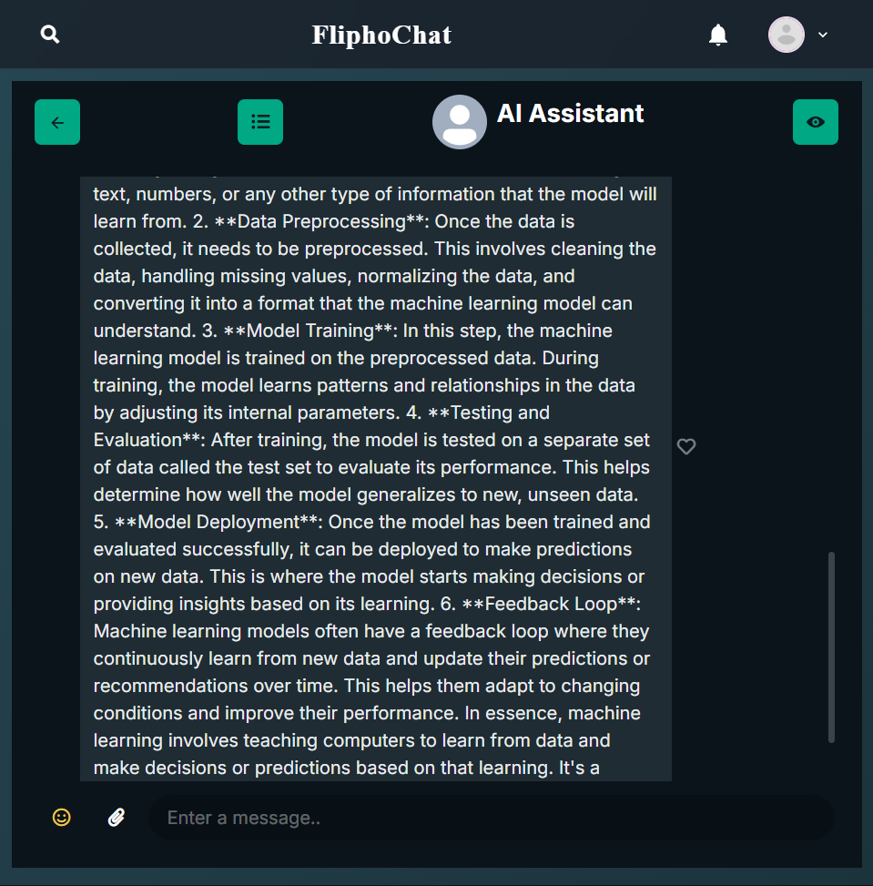
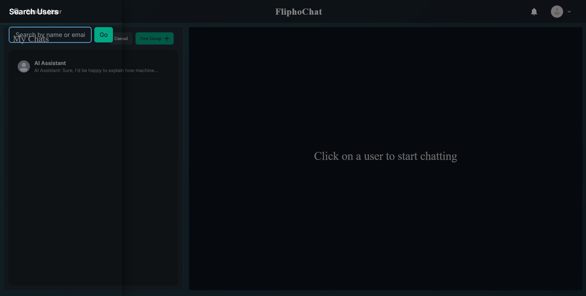
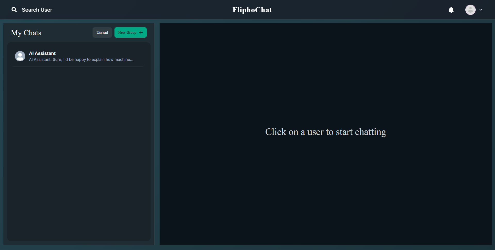

# Flipho Chat Room 💬


<p align="center">
  <a href="https://fliphochat.onrender.com/"><strong>View Deployed Website</strong></a>
</p>

## Overview
Flipho Chat Room is a full-stack real-time chat application built with the MERN stack. It offers a premium, **WhatsApp-inspired Dark Mode** experience with **AI-powered chat assistance**, allowing users to chat one-on-one, in groups, or with an AI assistant. Features include encrypted messaging, image sharing, emoji support, and seamless real-time communication.

---

## ✨ Key Features

### 🤖 AI-Powered Chat Assistant
*   **Intelligent AI Assistant**: Chat with an AI assistant powered by OpenAI GPT-4o-mini
*   **Context-Aware Responses**: AI maintains conversation context for natural, helpful interactions
*   **Automatic Responses**: AI responds automatically when you send messages
*   **Quality Conversations**: Detailed, thoughtful responses that adapt to question complexity
*   **Token Usage Tracking**: Monitor AI usage and costs via `/api/ai/usage` endpoint

### 🎨 WhatsApp-Style Dark Theme
*   **Premium Aesthetic**: Completely redesigned UI featuring deep black/green backgrounds (`#0b141a`) and teal accents (`#00a884`)
*   **Eye-Friendly Design**: High-contrast text and solid colors for better readability and reduced eye strain
*   **Modern Interface**: Clean, minimalist design inspired by WhatsApp's dark mode

### 💬 Live Chatting
*   **One-on-One Chats**: Private, encrypted conversations between two users
*   **Group Chats**: Create groups, name them, add/remove members, and manage admins
*   **Real-Time Communication**: Instant message delivery using Socket.io
*   **Message Persistence**: All messages are saved and persist across sessions
*   **Message Reactions**: React to messages with emojis

### 📎 Rich Media Support
*   **Image Uploads**: Share images directly within the chat
*   **Emoji Picker**: Built-in emoji picker for expressive communication
*   **File Attachments**: Support for various file types

### ⚡ Real-Time Features
*   **Live Notifications**: Instant alerts when you receive messages
*   **Typing Indicators**: See when someone is typing a response
*   **Read Receipts**: Track message read status
*   **Online Status**: See who's online in real-time
*   **Socket.io Integration**: Seamless real-time updates without page refreshes

### 🔐 Security & Privacy
*   **End-to-End Encryption**: Messages encrypted using AES encryption
*   **JWT Authentication**: Secure token-based authentication
*   **Password Hashing**: Bcrypt password encryption
*   **Access Control**: Users can only access their own chats

### 👥 User Management
*   **Search Users**: Find friends by name or email
*   **Profile Management**: View and manage user profiles
*   **User Avatars**: Custom profile pictures
*   **Group Administration**: Group owners and admins can manage members

---

## 💻 Technologies Used

| Layer | Technology |
| :--- | :--- |
| **Frontend** | ReactJS, Chakra UI, Framer Motion, Axios, React Lottie |
| **Backend** | Node.js, Express.js, Multer (file uploads) |
| **Database** | MongoDB, Mongoose |
| **Real-Time** | Socket.io |
| **Authentication** | JWT, bcryptjs |
| **AI Integration** | OpenAI API (GPT-4o-mini), OpenAI SDK |
| **Encryption** | CryptoJS (AES encryption) |
| **Deployment** | Docker, Docker Compose |

---

## 🏁 Getting Started

### Prerequisites
*   Node.js (v14 or higher) installed
*   MongoDB installed locally or MongoDB Atlas account
*   OpenAI API key (for AI features)
*   Docker & Docker Compose (optional, for containerized deployment)

### Installation

#### Option 1: Docker (Recommended)

1. **Clone the repository**
   ```bash
   git clone https://github.com/gaurav147-star/Flipho_Chat_Room.git
   cd Flipho_Chat_Room
   ```

2. **Create `.env` file** in the root directory:
   ```env
   PORT=5000
   MONGO_URI=your_mongodb_uri
   JWT_SECRET=your_jwt_secret
   SECRET_KEY=your_message_encryption_key
   OPENAI_API_KEY=your_openai_api_key
   OPENAI_MODEL=gpt-4o-mini
   NODE_ENV=production
   ```

3. **Start with Docker Compose**
   ```bash
   docker-compose up -d --build
   ```

   The application will be available at:
   - Frontend: `http://localhost:3000`
   - Backend API: `http://localhost:5000`
   - MongoDB: `mongodb://localhost:27017`

#### Option 2: Manual Setup

1. **Clone the repository**
   ```bash
   git clone https://github.com/gaurav147-star/Flipho_Chat_Room.git
   cd Flipho_Chat_Room
   ```

2. **Install Dependencies**
   ```bash
   # Install root dependencies
   npm install
   
   # Install frontend dependencies
   cd frontend && npm install
   
   # Install backend dependencies
   cd ../backend && npm install
   ```

3. **Environment Setup**
   Create a `.env` file in the root directory:
   ```env
   PORT=5000
   MONGO_URI=your_mongodb_uri
   JWT_SECRET=your_jwt_secret
   SECRET_KEY=your_message_encryption_key
   OPENAI_API_KEY=your_openai_api_key
   OPENAI_MODEL=gpt-4o-mini
   ```

4. **Run the Application**
   ```bash
   # From root directory - starts backend
   npm start
   
   # In a separate terminal - start frontend
   cd frontend
   npm start
   ```

   The app should now be running at `http://localhost:3000`!

---

## 📸 Screenshots

### Read More Feature

*Long messages from other users are automatically truncated with a "Read more" button. Click to expand and see the full message, keeping the chat interface clean and organized.*

### Main Chat Interface

*Chat list showing AI Assistant and other conversations*

### AI Chat Conversation

*Example of a detailed AI conversation with context-aware responses*

### Search Users

*Search functionality to find and connect with other users*

### Login Page

*User authentication interface*

---

## 🚀 API Endpoints

### Authentication
- `POST /api/user/login` - User login
- `POST /api/user/register` - User registration
- `GET /api/user` - Get user profile
- `PUT /api/user` - Update user profile

### Chats
- `GET /api/chat` - Get all chats for user (includes AI chat)
- `POST /api/chat` - Create or access one-on-one chat
- `POST /api/chat/group` - Create group chat
- `PUT /api/chat/rename` - Rename group chat
- `PUT /api/chat/groupadd` - Add user to group
- `PUT /api/chat/groupremove` - Remove user from group

### Messages
- `GET /api/message/:chatId` - Get all messages for a chat
- `POST /api/message` - Send a message
- `PUT /api/message/reaction` - React to a message

### AI
- `GET /api/ai/usage` - Get AI token usage statistics

---

## 🔧 Configuration

### Environment Variables

| Variable | Description | Required |
| :--- | :--- | :--- |
| `PORT` | Backend server port | Yes |
| `MONGO_URI` | MongoDB connection string | Yes |
| `JWT_SECRET` | Secret key for JWT tokens | Yes |
| `SECRET_KEY` | Key for message encryption | Yes |
| `OPENAI_API_KEY` | OpenAI API key for AI features | Yes (for AI) |
| `OPENAI_MODEL` | OpenAI model to use (default: gpt-4o-mini) | No |

### Docker Configuration

The application includes:
- `Dockerfile` - Backend container configuration
- `frontend/Dockerfile` - Frontend container configuration
- `docker-compose.yml` - Multi-container orchestration
- `frontend/nginx.conf` - Nginx configuration for frontend

---

## 🎯 Features in Detail

### AI Integration
- **Automatic Chat Creation**: Every user automatically gets an AI chat
- **Context Preservation**: AI remembers last 15 messages for context
- **Smart Responses**: Adapts response length based on question complexity
- **Error Handling**: Graceful handling of API errors and rate limits
- **Usage Tracking**: Monitor token usage per user/chat

### Message Features
- **Encryption**: All messages encrypted with AES before storage
- **Chronological Ordering**: Messages sorted by creation time
- **Image Support**: Upload and share images
- **Reactions**: React to messages with emojis
- **Read Receipts**: Track who has read messages

### Group Chat Features
- **Group Creation**: Create groups with custom names
- **Admin Management**: Assign group admins
- **Member Management**: Add/remove members (admins only)
- **Group Settings**: Rename groups, update group pictures

---

## 🐛 Troubleshooting

### Common Issues

1. **AI not responding**
   - Check if `OPENAI_API_KEY` is set correctly
   - Verify API key has sufficient credits
   - Check backend logs for errors

2. **Messages not showing**
   - Ensure MongoDB is running and connected
   - Check `SECRET_KEY` is set correctly
   - Verify user has access to the chat

3. **Socket.io connection issues**
   - Check CORS settings in `server.js`
   - Verify Socket.io server is running
   - Check browser console for connection errors

4. **Docker issues**
   - Ensure Docker Desktop is running
   - Check container logs: `docker-compose logs`
   - Verify `.env` file is in root directory


Made with ❤️ by Gaurav
