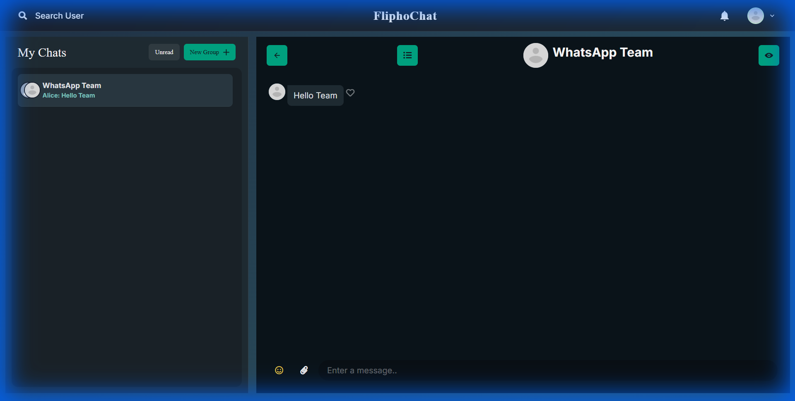

# Flipho Chat Room 💬



<p align="center">
  <a href="https://fliphochat.onrender.com/"><strong>View Deployed Website</strong></a>
</p>

## Overview
Flipho Chat Room is a full-stack real-time chat application built with the MERN stack. It offers a premium, **WhatsApp-inspired Dark Mode** experience, allowing users to chat one-on-one or in groups, share images, and connect seamlessly.

---

## 🚀 New Features & Updates

### 🎨 WhatsApp-Style Dark Theme
*   **Premium Aesthetic**: A completely redesigned UI featuring deep black/green backgrounds (`#0b141a`) and teal accents (`#00a884`) for a sleek, modern look.
*   **Eye-Friendly**: High-contrast text and solid colors replace the previous glassmorphism for better readability and reduced eye strain.

### 📎 Rich Media Support
*   **Image Uploads**: Share memories instantly! Users can now upload and send images directly within the chat.
*   **Emoji Picker**: Express yourself fully with a built-in emoji picker integrated into the chat input.

### ⚡ Real-Time Enhancements
*   **Live Notifications**: Get instant alerts when you receive a message.
*   **Typing Indicators**: See exactly when someone is typing a response.
*   **Read Receipts**: Message status tracking with visual indicators.

---

## 🛠 Features

### 1. Authentication
*   **Secure Login/Signup**: JWT-based authentication ensures user data is safe. Passwords are encrypted before storage.
*   **Guest User**: (Optional) Quickly test the app with provided guest credentials.

### 2. Live Chatting
*   **One-on-One Chats**: Private, encrypted conversations between two users.
*   **Group Chats**: Create groups, name them, and add multiple friends for collective conversations.
*   **Real-Time Socket.io**: Messages are delivered instantly without page refreshes.

### 3. User Experience
*   **Search Users**: Find friends by name or email.
*   **Profile Management**: View user profiles and details.
*   **Responsive Design**: Fully optimized for desktop and mobile devices.

---

## 💻 Technolgies Used

| Layer | Technology |
| :--- | :--- |
| **Frontend** | ReactJS, Chakra UI, Framer Motion, Axios |
| **Backend** | Node.js, Express.js |
| **Database** | MongoDB |
| **Real-Time** | Socket.io |
| **Auth** | JWT, bcryptjs |

---

## 🏁 Getting Started

### Prerequisites
*   Node.js installed
*   MongoDB installed (or MongoDB Atlas URI)

### Installation

1.  **Clone the repository**
    ```bash
    git clone https://github.com/gaurav147-star/Flipho_Chat_Room.git
    cd Flipho_Chat_Room
    ```

2.  **Install Dependencies** (Root, Frontend, and Backend)
    ```bash
    npm install
    cd frontend && npm install
    cd ../backend && npm install
    ```

3.  **Environment Setup**
    Create a `.env` file in the root directory:
    ```env
    PORT=5000
    MONGO_URI=your_mongodb_uri
    JWT_SECRET=your_jwt_secret
    SECRET_KEY=your_message_encryption_key
    ```

4.  **Run the Application**
    ```bash
    # Run both frontend and backend concurrently
    npm start
    ```

The app should now be running at `http://localhost:3000`!

---

## 📸 Screenshots

### Old Interface (Reference)
<details>
<summary>Click to see previous designs</summary>

</details>

---

Made with ❤️ by Gaurav
