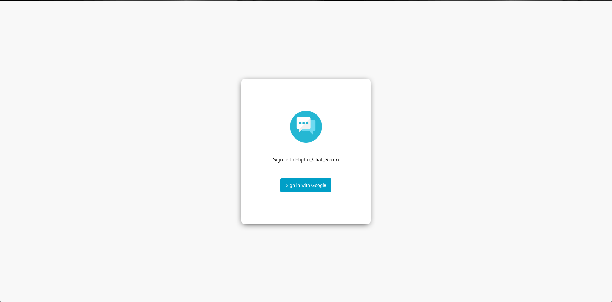
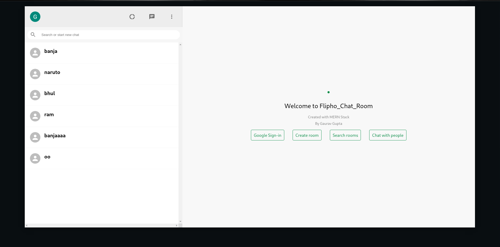
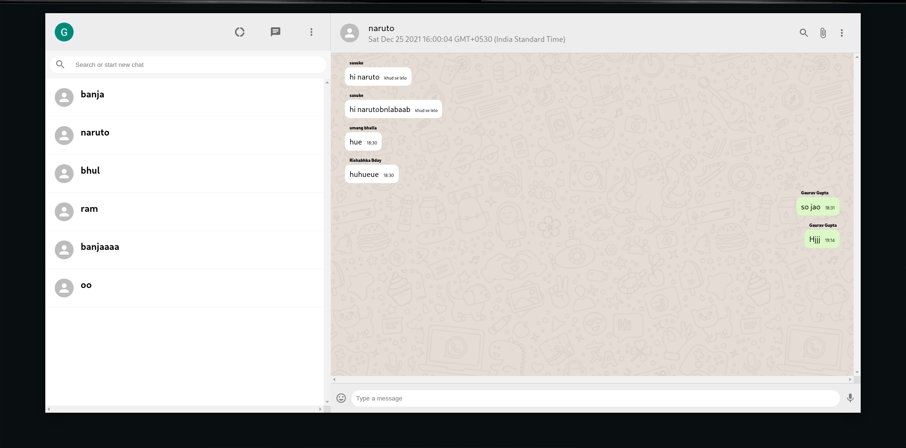

# [**Flipho_Chat_Room**](https://fliphochat.onrender.com/)

● Developed a real-time chat application using ReactJS, MongoDB, ExpressJS, NodeJS, ChakraUI, Socket.io, and CryptoJS.

● Implemented secure communication with CryptoJS for AES encryption and JWT authentication. Ensured privacy, user authenticity, and information protection in the chat application.

● Maintained a friendly environment while integrating these security measures. Facilitating group chats and one-to-one conversations, while utilizing Socket.io for real-time communication.

[Visit&nbsp;the&nbsp;live&nbsp;website](https://fliphochat.onrender.com/)

---

## Required Environment Variables

| VARIABLE   | Sample value                 |
| ---------- | ---------------------------- |
| DATABASE   | mongodb://localhost/chatroom |
| JWT_SECRET |
| SECRET_KEY |

## Installation Instructions

1. Install _Node.js_
2. Install _npm_
3. If you plan to use a local instance of _MongoDB database_, install _MongoDB atlas_.
4. Clone this github repo.
5. In the local project directory, create a new file called "`.env`".
6. Setup the environment variables as described above.
7. Open the local project directory in a terminal, and run: `npm install`.

## Available Scripts

## In the project directory, you can run:

`cd client`

### `npm run start`

Runs the front-end client app in the development mode. 
Open [http://localhost:3000](http://localhost:3000) to view it in the browser.

`cd server`

### `nodemon index.js`

Runs the back-end server app in the development mode. 
Open [http://localhost:5000](http://localhost:8000) to view it in the browser. Please note that the server requires an active instance of the **MongoDB database**. Either provide a _MongoDB atlas_ link in the `URI` environment variable, or use a local database, by placing its DATABASE in the same.

---

## Application Screenshots

